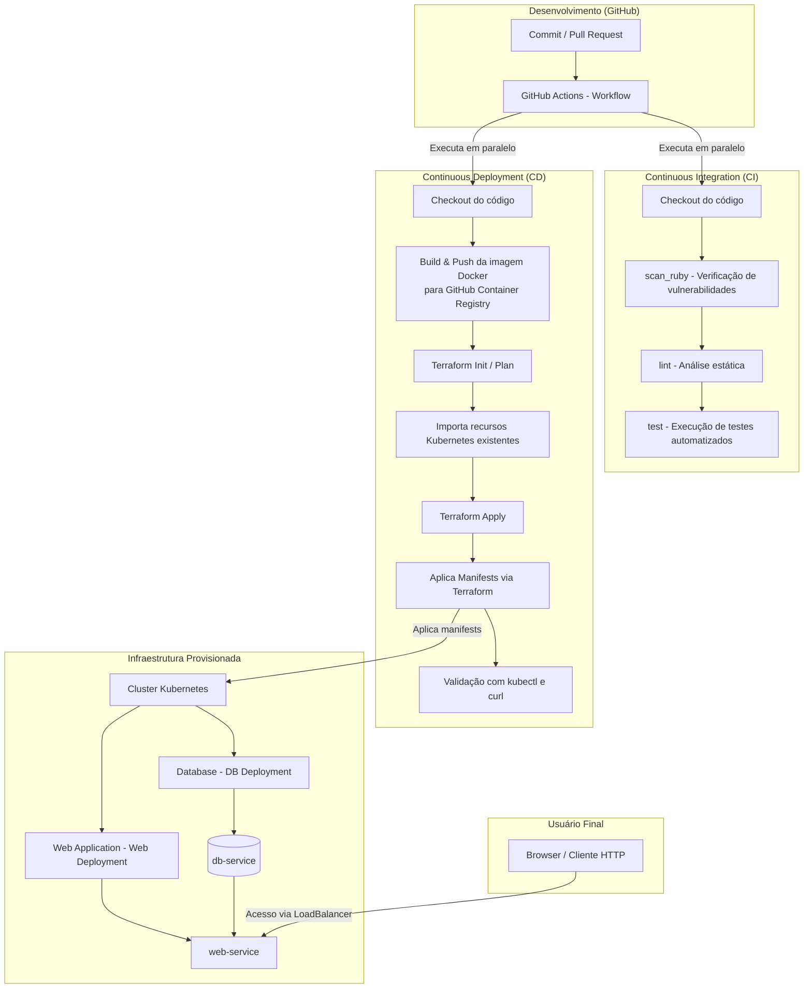

# Workshop API

Este projeto implementa um sistema completo para gerenciamento de oficinas mecânicas, possibilitando o controle de ordens de serviço, cadastro de clientes e seus veículos, além do gerenciamento de peças, insumos e geração de orçamentos.

## Tecnologias
- Ruby on Rails 7.2.2
- PostgreSQL 15
- RSpec para testes
- Brakeman para análise de segurança
- Simplecov para análise de cobertura de testes
- Docker para containerização

## Estrutura

- `application/..`: orquestram os casos de uso dos domínios (`*_application.rb`) e os objetos que representam os comandos do sistemas (`application/commands/*_command.rb`).
- `domain/..`: contém as regras de negócio, onde serão aplicadas as lógicas de cada entidade do sistema.
- `infra/..`: responsável por acessar os dados (`/repositories`) e realizar consultas complexas (`/query_objects`)
- `web/..`: responsável pela interação com o usuário através de APIs (`/controllers`)

```bash
.
├── layers
│   ├── application                      # Camada de aplicação
│   │   ├── <context_domain_1>           # Ex: customer, service_order, service_order_item
│   │   │   ├── commands                 # Objetos que representam ações ou operações do sistema (ex: CreateCustomerCommand)
│   │   │   ├── <context>_application.rb # Serviço de aplicação que orquestra casos de uso do domínio
│   │   │   └── ...
│   │   └── ...
│   │
│   ├── domain                 # Camada de domínio: entidades e regras de negócio
│   │   ├── <context_domain_1> # Ex: customer, service_order, service_order_item
│   │   │   ├── entidade.rb    # Exemplo: customer.rb, representando entidade com lógica e regra de negócio
│   │   │   └── ...
│   │   └── ...
│   │
│   ├── infra                         # Infraestrutura técnica para persistência, filas, jobs etc.
│   │   ├── models                    # Representação ORM dos dados
│   │   │   └── application_record.rb # Classe base para models ORM; todos os models herdam dela
│   │   ├── repositories              # Abstração para acesso a dados (ex: CustomerRepository)
│   │   ├── query_objects             # Consultas especializadas para recuperar dados complexos
│   │   ├── jobs                      # Processos assíncronos e background jobs
│   │   └── ...
│   │
│   └── web             # Camada de apresentação (HTTP)
│       ├── controllers # Controladores que processam requisições e delegam para application
│       └── concerns    # Módulos reutilizáveis para controllers (Ex: autenticação)
```

## Execução e Documentação:
```bash
ln -s .env.example .env
make setup
make server
```
É possível consultar a documentação da API com **Swagger** em:
```
http://localhost:3000/api-docs/index.html
```

#### **Collection para as APIs**: [Insomnia](docs/collection.yaml)

## Testes e Cobertura
```bash
make test
```

Esse comando rodará os testes e imprimirá no console o resultado.

Exemplo:
```bash
Finished in 1.09 seconds (files took 2.35 seconds to load)
76 examples, 0 failures

Coverage report generated for RSpec to /app/coverage.
Line Coverage: 98.27% (910 / 926)

COVERAGE:  98.27% -- 910/926 lines in 71 files

...
```

Além disso, é gerado um arquivo em `/coverage/index.html` contendo o relatório completo. Esse arquivo também está disponível pós a execução da pipeline do Github Actions do repositório.

## Kubernetes
```bash
# Opcional: limpar pods antigos
kubectl delete deployments,services,secrets,configmaps --all

### Aplicar as configurações:
kubectl apply -f k8s/

### Verificar pods
kubectl get pods -w

### Acessar o pod:
kubectl exec -it deployment/web-deployment -- /bin/bash

### Rodar as migrations:
kubectl exec -it deployment/web-deployment -- bundle exec rake db:migrate

### Criar os seeds:
kubectl exec -it deployment/web-deployment -- bundle exec rake db:seed

### Reiniciar pods:
kubectl rollout restart deployment web-deployment

### (Local) Disponibilizar External IP
minikube tunnel
```

## Terraform
Antes de tudo é necessário iniciar o minikube com `minikube start`
```bash
# Ir para o diretório de infra
cd infra/

# Iniciar o terraform
terraform init

# Opcional: Destruir os recursos antigos
terraform destroy

# Visualizar o plano de criação dos recursos
terraform plan

# Aplicar as configurações dos recursos
terraform apply

# (Local) Disponibilizar External IP
minikube tunnel
```

## Fluxo CI/CD e Provisionamento
